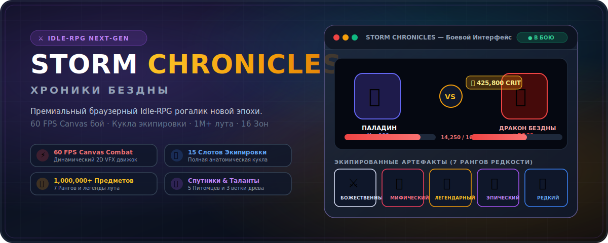
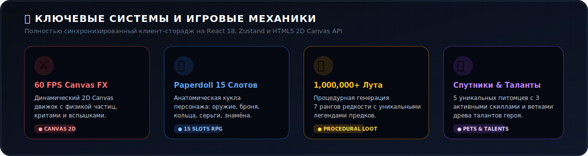

<div align="center">



[](https://vitejs.dev/)
[](https://reactjs.org/)
[](https://www.typescriptlang.org/)
[](https://tailwindcss.com/)
[](LICENSE)

### ⚔️ **Премиальный браузерный Idle-RPG рогалик новой эпохи**
**16 Территорий · 240+ Монстров · 1,000,000+ Процедурных Предметов · 24 Таланта · 12 Скиллов · Анатомическая Кукла Экипировки**

---

</div>

## 📌 Обзор Проекта

**STORM CHRONICLES (Хроники Бездны)** — это современная браузерная Idle-RPG с глубокими рогаликовыми механиками, визуальными эффектами на HTML5 Canvas 2D и продуманной системой прогрессии персонажа.

Игра создана по стандартам **Dark Fantasy RPG UX**, объединяя плавность 60 FPS сражений, анатомическую панель снаряжения (Paperdoll), генерацию легендарных предметов с историческим лором и систему спутников с уникальными активными умениями.

---

## ⚡ Ключевые Системы и Игровые Механики



### ⚔️ 1. Боевая Система HTML5 Canvas (60 FPS)
- **Высокопроизводительный 2D рендеринг**: Динамический canvas-движок с физикой физических частиц, анимациями выпадов героя, вспышек критических ударов, метеорных дождей и заклинаний.
- **Отказоустойчивый аудио-модуль**: Полная защита Web Audio API в блоках `try/catch` от блокировок авто-воспроизведения звука браузерами Chrome/Edge.
- **Стабильная система VFX**: Идентификация спецэффектов через уникальные таймстампы гарантирует 100% отображение вылетающего урона без пропусков кадров.

### 🛡️ 2. Анатомическая Кукла Снаряжения (Paperdoll RPG)
- **15 Полноценных Слотов Экипировки**: Оружие, Шлем, Броня, Наплечники, Плащ, Штаны, Знамя, Перчатки, Наколенники, Сапоги, Амулет, 2 Кольца, 2 Серьги.
- **Умная фильтрация инвентаря**: Клик по любому слоту куклы автоматически фильтрует инвентарь по выбранному типу предмета.
- **Сравнение характеристик**: Всплывающие подсказки с наглядным сравнением урона, брони и HP со стрелочками прироста `▲`.

### 💎 3. Процедурный Лут-Генератор (1,000,000+ Вариантов)
- **7 Рангов Редкости**: Обычный, Необычный, Редкий, Эпический, Легендарный, Мифический, Божественный.
- **Аффиксы и Легенды**: Каждый предмет обладает процедурно сгенерированными характеристиками и бессмертными балладами о древних богах и кузнецах.

### 🐉 4. Спутники и Активные Навыки Питомицев
- **5 Уникальных Питомцев**: Огненный Дракончик, Изумрудный Страж, Теневой Демон, Астральный Волк, Паровой Конструкт.
- **По 3 Активных Навыка у Каждого Спутника**: Атакующие залпы, баффы брони/скорости и ультимативные исцеляющие заклинания.
- **Полноразмерный интерфейс талантов**: Таланты спутников расположены во всю ширину блока с подробными описаниями и рангами без обрезок текста.

### 🌟 5. Глубокое Древо Талантов и Скиллов Героя
- **Удобная группировка по Веткам**: Фильтрация веток (`🌐 Все Ветки`, `🔥 Ветка 1`, `🛡️ Ветка 2`), поиск талантов и статусные вкладки.
- **Автокаст Скиллов**: Гибкая настройка автоматического применения боевых заклинаний по перезарядке.

---

## 🛠️ Технологический Стек

| Слой | Технологии |
| :--- | :--- |
| **Core Framework** | React 18 · TypeScript 5 · Vite 5 |
| **Graphics & Engine** | HTML5 2D Canvas API · Custom Particle System |
| **State & Storage** | Zustand Store · LocalStorage Synchronizer |
| **Styling & UX** | TailwindCSS 3 · Glassmorphism · Century Gothic Typography |

---

## 🚀 Быстрый Запуск и Сборка

### 1. Клонирование репозитория:
```bash
git clone https://github.com/ReiKatari/STORM_CHRONICLES.git
cd STORM_CHRONICLES
```

### 2. Установка зависимостей:
```bash
npm install
```

### 3. Запуск сервера разработки:
```bash
npm run dev
```
Откройте браузер по адресу `http://localhost:3003` (или порту, указанному в терминале).

### 4. Сборка для Production:
```bash
npm run build
```

---

## 📂 Структура Проекта

```text
STORM_CHRONICLES/
├── assets/
│   └── readme/
│       ├── hero.svg        # Проектный SVG Hero заголовок
│       └── features.svg    # SVG визуализация ключевых систем
├── public/
│   ├── backgrounds/        # Фоны 16 игровых зон
│   ├── heroes/             # Арт-токены 10 классов героев
│   ├── monsters/           # Арт-токены 240+ монстров и боссов
│   └── pets/               # Иллюстрации 5 питомцев
├── src/
│   ├── components/game/    # Компоненты UI (EquipmentPanel, PetsPanel, TalentsPanel, etc.)
│   ├── game/               # Логика игры (store.ts, engine.ts, sound.ts, pets.ts, items.ts)
│   ├── App.tsx             # Главный игровой лейаут
│   └── index.css           # Кастомные Tailwind & Glassmorphism стили
└── package.json
```

---

## 📄 Лицензия

Проект распространяется под лицензией **MIT**. Подробная информация находится в файле [LICENSE](LICENSE).

<div align="center">
<sub>Designed with ❤️ by ReiKatari · Powered by AntiGravity &amp; Beautify GitHub README</sub>
</div>
